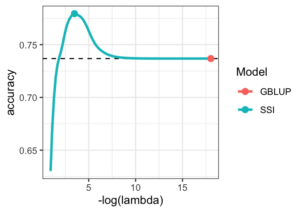
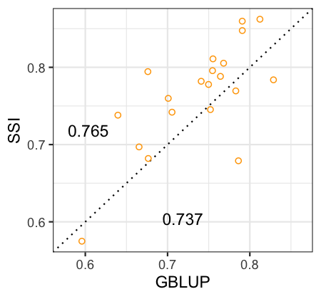
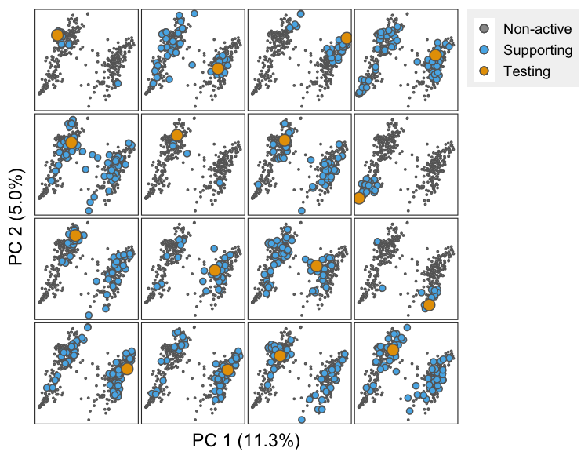

```{r initialsetup, include=FALSE}
knitr::opts_chunk$set(cache=FALSE)
```

# Implementation
This document contains the scripts used to perform all the analyses presented in the manuscript on the derivation of the Sparse Genomic Prediction approach (Sparse Selection Index) for grain yield. For demonstration purposes, we use data from the Wheat-small data set which is available with the [BGLR](https://github.com/gdlc/BGLR-R) R-package [@Perez2014]. Sparse Selection Indices will be derived using the [SFSI](https://github.com/MarcooLopez/SFSI) R-package [@Lopez-Cruz2020].


## Data preparation

The following code shows how to prepare data for environment 1; all the analyses hereinafter are based on this data. 

```{r eval=FALSE}
library(SFSI)
if(requireNamespace("BGLR")){
 data(wheat, package="BGLR")     # Load data from the BGLR package
}

# Select the environment 1 to work with     
y <- as.vector(scale(wheat.Y[,1]))     

# Calculate G matrix       
G <- tcrossprod(scale(wheat.X))/ncol(wheat.X)      

# Save data
save(y, G, file="geno_pheno.RData")      
```

## Heritability and variance components

Implementing the SSI requires an estimate of the heritability. We obtain this using a G-BLUP model $y_i=\mu+u_i+\varepsilon_i$ with $\varepsilon_i \overset{iid}{\sim} N(0,\sigma_\varepsilon^2)$ and $\boldsymbol{u}\sim N(\textbf{0},\sigma_u^2 \boldsymbol{G})$. This model can be fitted with the function `fitBLUP` included in the SFSI R-package. The BGLR R-package can be also used to fit a Bayesian version of the model. The code below illustrates how to estimate heritability using the function `fitBLUP`.

```{r eval=FALSE}
load("geno_pheno.RData") # Load data 

# Fit model
fm0 <- fitBLUP(y, K=G) 
fm0$theta <- fm0$varE/fm0$varU          # Residual/genetic variances ratio
fm0$h2 <- fm0$varU/(fm0$varU+fm0$varE)  # Heritability
c(fm0$varU,fm0$varE,fm0$theta,fm0$h2)   # Print variance components

save(fm0, file="varComps.RData")
```

## Training-testing partitions

The code below produces training (trn, $70\%$) and testing (tst, $30\%$) partitions. The parameter `nPart` defines the number of partitions. The output is a matrix with `nPart` columns containing 1's and 0's indexing the observations that are assigned to the training and testing sets, respectively. The object is saved in the file `partitions.RData` and will be used in later analyses.

```{r eval=FALSE}
nPart <- 5                        # Number of partitions
load("geno_pheno.RData")          # Load data 

nTST <- ceiling(0.3*length(y))    # Number of elements in TST set
partitions <- matrix(1,nrow=length(y),ncol=nPart)   # Matrix to store partitions
seeds <- round(seq(1E3, .Machine$integer.max/10, length=nPart))

for(k in 1:nPart){   
   set.seed(seeds[k])
   partitions[sample(1:length(y), nTST),k] <- 0
}
save(partitions, file="partitions.RData")    # Save partitions
```

## Accuracy of the G-BLUP and of the Sparse SI

The following script shows how to derive SSIs using the partitions above created. The weights of the SSI are computed using the function `SGP` for `nlambda=100` values of $\lambda$. The G-BLUP model is fitted for comparison using the function `fitBLUP`. The estimates of $\mu$, $\sigma^2_u$ and $\sigma^2_\varepsilon$ obtained from the G-BLUP model will be passed to the function `SGP` to save time. Indices denoting training and testing sets are passed through the `trn` and `tst` arguments, respectively. The accuracy of the G-BLUP and SSI models are stored in the object `accSSI`, and saved in the file `results_accuracy.RData`.

```{r eval=FALSE}
# Load data
load("geno_pheno.RData"); load("varComps.RData"); load("partitions.RData")

accSSI <- mu <- varU <- varE <- c()       # Objects to store results

for(k in 1:ncol(partitions))
{ cat("  partition = ",k,"\n")
  trn <- which(partitions[,k]==1)
  tst <- which(partitions[,k]==0)
    
  # G-BLUP model
  fm1 <- fitBLUP(y, K=G, trn=trn)
  mu[k] <- fm1$b        # Retrieve mu estimate
  varU[k] <- fm1$varU   # Retrieve varU
  varE[k] <- fm1$varE   # Retrieve varE

  # Sparse SI
  fm2 <- SGP(y, K=G, b=mu[k], varU=varU[k], varE=varE[k], 
             trn=trn, tst=tst, mc.cores=1, nlambda=100)
  fm3 <- summary(fm2)   # Useful function to get results
        
  accuracy <- c(GBLUP=cor(fm1$yHat[tst],y[tst]), fm3$accuracy[,1])/sqrt(fm0$h2)
  lambda <- c(min(fm3$lambda),fm3$lambda[,1])
  nsup <- c(max(fm3$nsup),fm3$nsup[,1])
  accSSI <- rbind(accSSI,data.frame(rep=k,SSI=names(accuracy),accuracy,lambda,nsup))
}
save(mu,varU,varE,accSSI,file="results_accuracy.RData")
```

## Displaying Results

The following code creates a plot showing the estimated genetic prediction accuracy by values of the penalty parameter (in logarithmic scale). The rightmost point in the plot corresponds to the G-BLUP model (obtained when $\lambda=0$). The point at the peak denotes the maximum accuracy (in the testing set) that was obtained by the SSI.

```{r eval=FALSE}
load("results_accuracy.RData")

dat <- data.frame(do.call(rbind,lapply(split(accSSI,accSSI$SSI),
         function(x) apply(x[,-c(1:2)],2,mean))))
dat$Model <- unlist(lapply(strsplit(rownames(dat),"\\."),function(x)x[1]))
 
dat2 <- do.call(rbind,lapply(split(dat,dat$Mod),function(x)x[which.max(x$acc),]))

if(requireNamespace("ggplot2")){
 ggplot2::ggplot(dat[dat$nsup>1,],ggplot2::aes(-log(lambda),accuracy)) + 
   ggplot2::geom_hline(yintercept=dat["GBLUP",]$accuracy, linetype="dashed") + 
   ggplot2::geom_line(ggplot2::aes(color=Model),size=1.1) + ggplot2::theme_bw() +
   ggplot2::geom_point(data=dat2,ggplot2::aes(color=Model),size=2.5)
}
```
<center>
{ width=45% }
</center>


## Cross-validating to obtain an optimal penalization

The snippet below can be used to perform, within each trn-tst partition, $k$-folds CV to get an 'optimal' value of $\lambda$ within the training data, and then used to fit an SSI for the testing set. The CV is implemented using the function `SGP.CV` from the SFSI R-package for one 5-folds CV, this can be set through the `nCV` and `nfolds` arguments. 

```{r eval=FALSE}
load("geno_pheno.RData");   load("varComps.RData")
load("partitions.RData");   load("results_accuracy.RData")

lambdaCV <- accSSI_CV <- nsupCV <- c()   # Objects to store results

for(k in 1:ncol(partitions))
{   cat("  partition = ",k,"\n")
    trn <- which(partitions[,k]==1)
    
    # Cross-validating the training set  
    fm1 <- SGP.CV(y, K=G, trn=trn, nlambda=100, mc.cores=1, nfolds=5, nCV=1)
    lambdaCV[k] <- summary(fm1)$optCOR["lambda"]
      
    # Fit a SSI with the estimated lambda
    fm2 <- SGP(y, K=G, b=mu[k], varU=varU[k], varE=varE[k], 
               trn=trn, tst=tst, lambda=lambdaCV[k])     
    
    accSSI_CV[k] <- summary(fm2)$accuracy/sqrt(fm0$h2)
    nsupCV <- cbind(nsupCV, fm2$nsup) 
}
save(accSSI_CV,lambdaCV,nsupCV,file="results_accuracyCV.RData")
```


After running the above analysis, the following snippet can be run to create a plot comparing partition-wise the accuracy of the optimal SSI with that of the G-BLUP. The average accuracies are also shown in the plot.

```{r eval=FALSE}
load("results_accuracy.RData"); load("results_accuracyCV.RData")

dat <- data.frame(GBLUP=accSSI[accSSI$SSI=="GBLUP",]$acc,SSI=accSSI_CV)
rg <- range(dat)
tmp <- c(mean(rg),diff(rg)*0.4)

if(requireNamespace("ggplot2")){
 ggplot2::ggplot(dat,ggplot2::aes(GBLUP,SSI)) + 
  ggplot2::geom_abline(slope=1,linetype="dotted") + ggplot2::theme_bw() +
  ggplot2::geom_point(shape=21,color="orange") + ggplot2::lims(x=rg,y=rg) +
  ggplot2::annotate("text",tmp[1],tmp[1]-tmp[2],label=round(mean(dat$GBLUP),3)) +
  ggplot2::annotate("text",tmp[1]-tmp[2],tmp[1],label=round(mean(dat$SSI),3))
}
```
<center>
{ width=40% }
</center>


The code below creates a plot showing the distribution of the number of points in the support set for the SSI, across all partitions.

```{r eval=FALSE}
load("results_accuracyCV.RData")

dat <- data.frame(nsup=as.vector(nsupCV))

bw <- round(diff(range(dat$nsup))/40)
if(requireNamespace("ggplot2")){
 ggplot2::ggplot(data=dat,ggplot2::aes(nsup,stat(count)/length(nsupCV))) +  
    ggplot2::theme_bw() +
    ggplot2::geom_histogram(color="gray20",fill="lightblue",binwidth=bw) +
    ggplot2::labs(x=bquote("Support set size(" *n[sup]*")"),y="Frequency")
}
```
<center>
{ width=45% }
</center>

## Subject-specific training sets

The next script can be used to create a plot showing (for a single trn-tst partition) the subset of points in the support set, for each individual being predicted. This plot can be made through the function `net.plot` from the SFSI package.

```{r eval=FALSE}
# Load data
load("geno_pheno.RData"); load("partitions.RData"); load("results_accuracyCV.RData")

part <- 1      # Choose any partition from 1,…,nPart
trn <- which(partitions[,k]==1)
tst <- which(partitions[,k]==0)

# Fit SSI with lambda previously estimated using CV
fm <- SGP(y, K=G, trn=trn, tst=tst, lambda=lambdaCV[part])

plot(net(fm, K=G), i=1:16, unified=FALSE, main=NULL, bg.col="white",
     set.size=c(3,1.5,0.2), point.color="gray40", axis.labels=FALSE)  
```
<center>
{ width=55% }
</center>

# References


