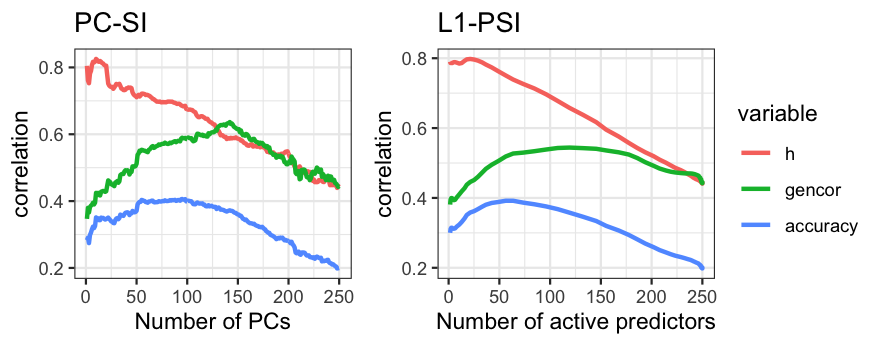
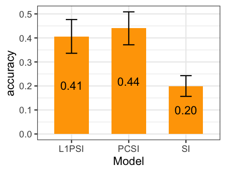
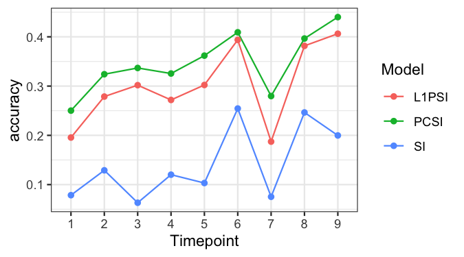
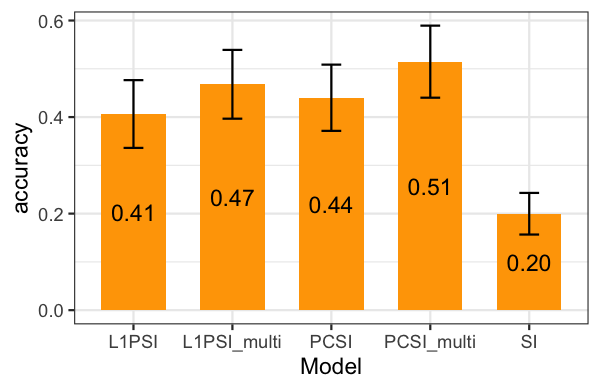
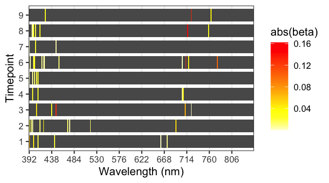

```{r initialsetup, include=FALSE}
knitr::opts_chunk$set(cache=FALSE)
```

# Implementation

This document contains the scripts used to perform all the analyses presented in the manuscript on the derivation of selection indices for grain yield (as selection target) using all the wavelengths (as measured phenotypes). Analyses will be implemented in `R` software [@RCore2019] using the `SFSI` R-package.

## Experimental data

The data set consists of 1,092 inbred wheat lines grouped into 39 trials and grown during the 2013-
2014 season at the Norman Borlaug experimental research station in Ciudad Obregon, Sonora,
Mexico. Each trial consisted of 28 breeding lines that were arranged in an alpha-lattice design with
three replicates and six sub-blocks. The trials were grown in four different environments:


|**Env**|  **Name**     | **Planting date**     | **Planting system**  |**Number of irrigations**|**N genotypes (records)**   |**Average (SD) YLD** |  
|:-----:|:-------------:|:--------------------------:|:-------------:|:--------------:|:-----------:|
|   E1  | Flat-Drought  |  Optimum     |   Flat      |  Minimal drip |  1,092 (3,274) | 2.06 (0.58) |
|   E2  | Bed-2IR       |  Optimum     |   Bed       |       2       |  1,090 (3,267) | 3.67 (0.43) |
|   E3  | Bed-5IR       |  Optimum     |   Bed       |       5       |  1,092 (3,274) | 6.11 (0.61) |
|   E4  | Bed-EHeat     |  Early       |   Bed       |       5       |  1,013 (2,858) | 6.43 (0.73) |


Records of grain yield (YLD, *ton ha*$^{-1}$) were collected as the total plot yield after maturity. Measurements for days to heading (DTH), days to maturity (DTM), and plant height (PH, \textit{cm}) were recorded only in the first replicate at each trial. Reflectance phenotypic data were
collected from the fields using both infrared and hyper-spectral cameras mounted on an aircraft on 9 different dates
(time-points) between January $10^\text{th}$ and March $27^\text{th}$, 2014. During each flight, data from 250 wavelengths
ranging from 392 to 850 nm were collected for each pixel in the pictures. The average
reflectance of all the pixels for each wavelength was calculated from each of the geo-referenced
trial plots and reported as each line reflectance.

Grain yield and image data were pre-adjusted using mixed-effects model that accounted for genotype, trial, replicate, and sub-block. No pre-adjusting was made for DTH, DTM, and PH traits. Pre-adjusted phenotypes were obtained by subtracting from the phenotypic record the mean plus BLUPs of trial, replicate, and sub-block effects.

Lines were sequenced using GBS technology. Next, SNP were extracted and filtered so that lines >50\% missing data were removed. Markers were recoded as –1, 0, and 1, corresponding to homozygous for the minor allele, heterozygous, and homozygous for the major allele, respectively. Next, markers with a minor allele frequency <0.05 and >15\% of missing data were removed. Remaining SNPs with missing values were imputed with the mean of observed genotypes.

The `SFSI` R-package includes the `wheatHTP` dataset containing (un-replicated) YLD from all environments E1,...,E4, and reflectance (latest time-point only) data from the environment E1 only. Marker data is also included in the dataset. The phenotypic and reflectance data are averages (line effects from mixed models) for 776 lines evaluated in 28 trials (with at least 26 lines each) for which marker information on 3,438 SNPs is available.

R-datasets (`*.RData`) `wheatHTP.E1`,...,`wheatHTP.E4` containing replicated (adjusted) phenotypic and reflectance data for all four environments are available at the GitHub repository https://github.com/MarcooLopez/Data_for_Lopez-Cruz_et_al_2020.

## Data downloading

Data wil be taken from the `SFSI` R-package (GitHub version). Each file corresponds to one environment and contains objects `Y`, `X`, and `VI`. Matrix `Y` contains pre-adjusted observations for YLD, DTH, DTM, and PH. Object `X` is a list type containing the hyper-spectral image data for all 9 time-points. Element `X[[j]]`,  $j=1,...,9$, is a matrix with 250 columns (wavelengths) and rows matched with those of matrix `Y`. Likewise, the object `VI` is a list with 9 elements being two-columns matrices containing green and
red NDVI. Following code shows how to prepare data for a single environment which will be used in later analyses. For demostration purposes, only data from 9 trials will be considered

```{r, Box1, eval=FALSE}
rm(list = ls())
setwd("~/Dropbox/projects/R_packages/test/pipeline")

site <- "https://github.com/MarcooLopez/Data_for_Lopez-Cruz_et_al_2020/raw/main"
filename <- "wheatHTP.E3.RData"

# Download file
download.file(paste0(site,"/",filename), filename, mode="wb")
load(filename)

trials <- as.numeric(as.character(Y$trial))

index <- trials %in% unique(trials)[1:6]   # For ease, only 6 trials
trials <- trials[index]
Y <- Y[index,]
X <- lapply(X,function(x)x[index,])
                
Y$gid <- factor(as.character(Y$gid)) 
Z <- model.matrix(~0+gid,data=Y)
K <- tcrossprod(Z)               # Connection of replicates
y <- as.vector(Y[,"YLD"])

# Save file
save(y, trials, K, X, file="prepared_data.RData")
```


## Heritability and variance components

Heritability can be calculated from variance components obtained by fitting the aforementioned genetic model for the whole data. Code below illustrates how to fit this model using the function `fitBLUP` from the `SFSI` R-package.

```{r, Box2, eval=FALSE}
library(SFSI)

# Load data 
load("prepared_data.RData")
EVD <- eigen(K)                 # Decomposition of K

# Fit model
y <- as.vector(scale(y))
fm0 <- fitBLUP(y, EVD=EVD, BLUP=FALSE) 
c(fm0$varU,fm0$varE,fm0$h2)

save(fm0, EVD, file="varComps.RData")
```


## Training-testing partitions

Code below illustrates how to split data into training (TRN) and testing (TST) sets. In this example, $\frac{2}{3}$ of the trials will be randomly assigned to the training set and the remaining $\frac{1}{3}$ trials to the testing set. The output will be a matrix whose columns are vectors with 1's and 2's indicating which observations are assigned to the training and testing sets, respectively. 

The time-point to be analyzed can be specified through variable `timepoints` thus it can be set to calculate covariances for all the 9 time-points. The number of TRN-TST partitions to run are specified through parameter `nPart`

The parameters will be saved in the file `paramaters.RData` and will be used later for single time-point and across time-points analyses.

```{r, Box3, eval=FALSE}
load("prepared_data.RData") # load data

#---------- parameters ------------#
pTST <- 1/3           # Perc of the trials to assign to testing
nPart <- 3            # Number of TRN-TST partitions to perform
timepoints <- 6:9     # Time-points to analyze
#----------------------------------#

nTrial <- length(unique(trials))
nTST <- ceiling(pTST*nTrial)  # Number of trials in TST set

seeds <- round(seq(1E3, .Machine$integer.max, length = 500))
partitions <- matrix(1,nrow=length(y),ncol=length(seeds))   # Object to store partitions
for(k in 1:length(seeds))
{   set.seed(seeds[k])
    tst <- sample(unique(trials),nTST,replace=FALSE)
    partitions[which(trials %in% tst),k] <- 2
}
save(partitions, pTST, nPart, timepoints, file="parameters.RData")
```


## Genetic covariances estimation

The genetic covariances between the grain yield and each of the wavelengths will be calculated using a sequence of genetic models implemented in the function `getGenCov` from the `SFSI` package. Code in snippet below shows how to calculate genetic and phenotypic covariances within time-point. Calculations are performed for each partition using data from training set only. 

Results are stored in matrices `gencov` and `phencov`, and saved in the file `covariances_tp_*.RData`.

```{r, Box4, eval=FALSE}
load("prepared_data.RData"); load("parameters.RData")

for(tp in timepoints){
  gencov <- phencov <- c()   # Matrices to store covariances

  for(k in 1:nPart)
  { cat("  partition = ",k,"of",nPart,"\n")
    indexTRN <- which(partitions[,k]==1)
    
    # Training set
    xTRN <- scale(X[[tp]][indexTRN,])
    yTRN <- as.vector(scale(y[indexTRN]))
    KTRN <- K[indexTRN,indexTRN]   # Relationship matrix (given by replicates)
  
    # Get genetic variances and covariances
    fm <- getGenCov(y=cbind(yTRN,xTRN), K=KTRN, scale=FALSE, pairwise=FALSE, verbose=FALSE)
    
    gencov <- cbind(gencov,fm$covU)
    phencov <- cbind(phencov,fm$covU + fm$covE)
  }
  save(gencov, phencov, file=paste0("covariances_tp_",tp,".RData"))
  cat("Time-point=",tp,". Done \n")
}
```

## Single time-point selection indices

Standard, L1-penalized and PC-based SIs will be fitted using data from a single time-point. The regression coefficients are to be obtained from training data within each partition previously created.

### Regression coefficients

Following code can be used to estimate regression coefficients using training data within each partition for the standard SI and for the PC-SI (with $1, 2,...,250$ PCs). Coefficients for L1-PSI are estimated the whose solutions are found using either the functions `LARS` or `solveEN` from the `SFSI` R-package. Function `solveEN` will yield solutions for a given grid of values of $\lambda$ while function `LARS` provides solutions for the entire $\lambda$ path.

Time-point can be specified through variable `timepoints`. Regression coefficients are stored in matrices `bSI`, `bPCSI` and `bL1PSI`, and saved in the file `coefficients_tp_*.RData`. Calculations are performed using genetic covariances calculated for the partitions previously created.


```{r, Box5a, eval=FALSE}
load("prepared_data.RData"); load("parameters.RData")

for(tp in timepoints){
  load(paste0("covariances_tp_",tp,".RData"))
  
  # Objects to store regression coefficients
  bSI <- bPCSI <- bL1PSI <- vector("list",nPart)

  for(k in 1:nPart)
  { cat("  partition = ",k,"of",nPart,"\n")
    indexTRN <- which(partitions[,k]==1)
    
    # Training set
    xTRN <- scale(X[[tp]][indexTRN,])
    VARx <- var(xTRN)
    EVDx <- eigen(VARx)
    
    # Standard SI
    VARinv <- EVDx$vectors %*% diag(1/EVDx$values) %*% t(EVDx$vectors)
    bSI[[k]] <- VARinv %*%  gencov[,k]    
    
    # PC-based SI
    VARinv <- diag(1/EVDx$values)
    gamma <- as.vector(VARinv %*% t(EVDx$vectors) %*%  gencov[,k])
    beta <- apply(EVDx$vectors %*% diag(gamma),1,cumsum)
    bPCSI[[k]] <- data.frame(I(beta),nsup=1:nrow(beta),lambda=NA)
    
    # L1-PSI
    fm <- solveEN(VARx, gencov[,k], nlambda=100)
    # fm <- LARS(VARx, gencov[,k])  # Second option
    beta <- t(as.matrix(fm$beta)[,-1])
    bL1PSI[[k]] <- data.frame(I(beta),nsup=fm$nsup[-1],lambda=fm$lambda[-1])
  }
  save(bSI, bPCSI, bL1PSI, file=paste0("coefficients_tp_",tp,".RData"))
  cat("Time-point=",tp,". Done \n")
}
```


### Accuracy of the index

The regression coefficients above calculated can be applied to data from testing set to derive selection indices ($\mathcal{I}_i$). Code below can be used to (i) compute the SIs for the testing data, and then (ii) calculate the accuracy of the index, the heritability of the index, and genetic correlation of the index with grain yield. These (co)variance components are obtained using the function `getGenCov`. 

Results for the three indices (standard SI, PC-SI and L1-PSI) are stored in the object matrix `accSI` and saved in the file `accuracy_tp_*.RData`. Calculations are performed across all partitions previously created.

```{r, Box5b, eval=FALSE}
load("prepared_data.RData"); load("parameters.RData")

for(tp in timepoints){
  load(paste0("coefficients_tp_",tp,".RData"))
  accSI <- c()    # Object to store accuracy components

  for(k in 1:nPart)
  { cat("  partition = ",k,"of",nPart,"\n")
    indexTST <- which(partitions[,k]==2)
    
    # Testing set
    xTST <- scale(X[[tp]][indexTST,])
    yTST <- as.vector(scale(y[indexTST]))
    KTST <- K[indexTST,indexTST]   # Connection given by replicates
    
    # Calculate the indices
    SI <- xTST %*% bSI[[k]]
    PCSI <- tcrossprod(xTST, bPCSI[[k]]$beta)
    L1PSI <- tcrossprod(xTST, bL1PSI[[k]]$beta)
    
    # Fit genetic models   
    fitSI <- as.matrix(data.frame(I(SI),I(PCSI),I(L1PSI)))
    fm <- getGenCov(y=cbind(yTST,fitSI), K=KTST, pairwise=FALSE, verbose=FALSE)
    fm$varU <- ifelse(fm$varU<0.05,0.05,fm$varU)
    
    # Retrieve accuracy components
    h <- sqrt(fm$varU/(fm$varU + fm$varE))[-1]
    gencor <- fm$covU/sqrt(fm$varU[1]*fm$varU[-1])
    acc2 <- fm$covU/sqrt(fm$varU[1])
    accuracy <- abs(gencor)*h
    
    nsup <- c(nrow(bSI[[k]]),bPCSI[[k]]$nsup,bL1PSI[[k]]$nsup)
    lambda <- c(min(bL1PSI[[k]]$lambda),bPCSI[[k]]$lambda,bL1PSI[[k]]$lambda)
    accSI <- rbind(accSI,data.frame(rep=k,SI=colnames(fitSI),h,gencor,accuracy,nsup,lambda))
  }
  save(accSI, file=paste0("accuracy_tp_",tp,".RData"))
  cat("Time-point=",tp,". Done \n")
}
```


### Effect of regularization on the accuracy of the index

The regularized selection indices were calculated for $q=1,2,...,250$ PCs for the PC-SI and for decreasing values, $\lambda_1,...,\lambda_{100}$, of the path of the penalization for the L1-PSI. In the later case, decreasing $\lambda$ will give increasing number of active number of predictors in the index. Code in the following snippet shows how to create a plot depicting the evolution of accuracy (and its components) over values of regularization (number of PCs or number of active predictors). Results for the standard SI corresponds to the case of a PC-SI with 250 PCs and a L1-PSI with 250 active predictors. These cases are shown at the right-most results in the plots.

```{r, Box6, eval=FALSE}
tp <- 9      # Time-point
load(paste0("accuracy_tp_",tp,".RData"))

accSI < split(accSI,as.character(accSI$SI))
accSI <- data.frame(do.call(rbind,lapply(accSI,function(x)apply(x[,-c(1,2)],2,mean,na.rm=T))))
accSI$SI <- unlist(lapply(strsplit(rownames(accSI),"\\."),function(x)x[1]))

# Plot of PC-SI
if(requireNamespace("reshape2") & requireNamespace("ggplot2")){
 dat <- reshape2::melt(accSI[accSI$SI=="PCSI",],id=c("nsup","lambda","SI"))
 plot1 <- ggplot2::ggplot(dat,ggplot2::aes(nsup,value,group=variable,color=variable)) +
  ggplot2::theme_bw() + ggplot2::geom_line() + 
  ggplot2::labs(title="PC-SI",y="correlation",x="Number of PCs")
  
# Plot of L1-PSI
 dat <- reshape2::melt(accSI[accSI$SI=="L1PSI",],id=c("nsup","lambda","SI"))
 plot2 <- ggplot2::ggplot(dat,ggplot2::aes(nsup,value,group=variable,color=variable)) +
  ggplot2::theme_bw() + ggplot2::geom_line() + 
  ggplot2::labs(title="L1-PSI",y="correlation",x="Number of active predictors")

 plot1; plot2
}
```

<center>
{ width=80% }
</center>


### Optimal regularized vs standard selection indices

An optimal regularized selection index can be chosen by selecting an optimal regularization (number of PCs or value of $\lambda$) such that the accuracy of selection of the resulting index in the testing set is maximum. Code below can be used to select the optimal PC-SI and L1-PSI, and to compare the accuracy of selection with that of the standard SI (non-regularized). Results are reported as an average across all partitions along with a $95\%$ confidence interval. 

```{r, Box7, eval=FALSE}
tp <- 9      # Time-point
load(paste0("accuracy_tp_",tp,".RData"))

accSI$Model <- unlist(lapply(strsplit(as.character(accSI$SI),"\\."),function(x)x[1]))
accSI <- split(accSI,paste(accSI$rep,"_",accSI$Model))
accSI <- do.call(rbind,lapply(accSI,function(x)x[which.max(x$accuracy),]))

dat <- aggregate(accuracy ~ Model, mean, data=accSI)
dat$sd <- aggregate(accuracy ~ Model,sd,data=accSI)$accuracy
dat$n <- aggregate(accuracy ~ Model,length,data=accSI)$accuracy
dat$se <- qnorm(0.975)*dat$sd/sqrt(dat$n)

if(requireNamespace("ggplot2")){
 ggplot2::ggplot(dat,ggplot2::aes(Model,accuracy)) + ggplot2::theme_bw() +
   ggplot2::geom_bar(stat="identity",width=0.6,fill="orange") + 
   ggplot2::geom_errorbar(ggplot2::aes(ymin=accuracy-se,ymax=accuracy+se),width=0.2) +
   ggplot2::geom_text(ggplot2::aes(label=sprintf("%.2f",accuracy),y=accuracy*0.5)) 
}
```

<center>
{ width=50% }
</center>


### Comparison of the indices across time-points

The accuracy of indirect selection for the optimal (i.e., the one with the highest accuracy of indirect selection) L1-PSI and PC-SI can be assessed across time-points and compared with a standard SI. Code in box below can be used to calculate the optimal PC-SI and L1-PSI, and to compare their accuracy of selection with that of the standard SI across all time-points. 

To this end, all the within time-point analyses (calculation of genetic covariances, regression coefficients, and prediction accuracy) must be previously performed for all the 9 time-points. This can be achieved using, for instance, by setting: `timepoints = 1:9`.

```{r, Box8, eval=FALSE}
load("parameters.RData")
AccSI <- c()
for(tp in timepoints)
{ load(paste0("accuracy_tp_",tp,".RData"))
  AccSI <- rbind(AccSI,data.frame(Timepoint=tp,accSI))
}

AccSI$Model <- unlist(lapply(strsplit(as.character(AccSI$SI),"\\."),function(x)x[1]))
AccSI <- split(AccSI,paste(AccSI$Timepoint,"_",AccSI$rep,"_",AccSI$Model))
AccSI <- do.call(rbind,lapply(AccSI,function(x)x[which.max(x$accuracy),]))
AccSI$Timepoint <- factor(as.character(AccSI$Timepoint))

dat <- aggregate(accuracy ~ Model+Timepoint,mean,data=AccSI)
dat$sd <- aggregate(accuracy ~ Model+Timepoint,sd,data=AccSI)$accuracy
dat$n <- aggregate(accuracy ~ Model+Timepoint,length,data=AccSI)$accuracy
dat$se <- qnorm(0.975)*dat$sd/sqrt(dat$n)

if(requireNamespace("ggplot2")){
 ggplot2::ggplot(dat,ggplot2::aes(Timepoint,accuracy,color=Model,group=Model)) +
    ggplot2::theme_bw() + ggplot2::geom_line() + ggplot2::geom_point() #+ geom_errorbar(aes(ymin=accuracy-se,ymax=accuracy+se),width=0.2)
}
```

<center>
{ width=65% }
</center>


## Multi time-point selection indices

Selection indices can be calculated to include reflectance data from multiple time-points. In this case, the vector of measured phenotypes $\boldsymbol{x}_i$ will contain $2,250$ traits corresponding to 250 wavebands measured at each of 9 time-points.

### Regression coefficients

Code in box below shows how to calculate coefficients for the PC-SI and L1-PSI using data from all 9 time-points. To this end, the genetic covariances of all $2,250$ traits with grain yield are needed, thus, all the within time-point genetic covariances must be previously calculated for all the 9 time-points. Results are saved in file `multi_timepoint_coefficients.RData`.

PC-SIs will be calculated including $1,2, ...,500$ PCs only (the maximum possible is $2,250$ PCs). The function `solveEN` will be used to calculate the regression coefficients for the L1-PSI using a grid of 100 values of $\lambda$.

```{r, Box9a, eval=FALSE}
load("prepared_data.RData"); load("parameters.RData")

Gencov <- c()   # To stack all covariances from all time-points
for(tp in timepoints)
{ load(paste0("covariances_tp_",tp,".RData"))
  Gencov <- rbind(Gencov,gencov)
}

# Objects to store regression coefficients
bPCSI <- bL1PSI <- vector("list",nPart)

for(k in 1:nPart)
{   cat("  partition = ",k,"of",nPart,"\n")
    indexTRN <- which(partitions[,k]==1)
    
    # Training set
    xTRN <- scale(do.call(cbind,X[timepoints])[indexTRN,])
    VARx <- var(xTRN)
    EVDx <- eigen(VARx)
    
    # PC-based SI
    gamma <- t(sweep(EVDx$vectors,2,1/EVDx$values,FUN="*")) %*%  Gencov[,k]
    beta <- apply(sweep(EVDx$vectors,2,as.vector(gamma),FUN="*"),1,cumsum)[1:500,]
    bPCSI[[k]] <- data.frame(I(beta),nsup=1:nrow(beta),lambda=NA)
    
    # L1-PSI
    fm <- solveEN(VARx, Gencov[,k],nlambda=100,maxiter=200,tol=1E-3)
    beta <- t(as.matrix(fm$beta)[,-1])
    bL1PSI[[k]] <- data.frame(I(beta),nsup=fm$nsup[-1],lambda=fm$lambda[-1])
}
save(bPCSI, bL1PSI, nPart, file="multi_timepoint_coefficients.RData")
```


### Accuracy of the index

As for the single time-point, the regression coefficients are applied to data from testing set to derive selection indices. The following code shows how to (i) compute the multi time-point PC-SI and L1-PSI for the testing data, and then (ii) calculate the accuracy of the index, the heritability of the index, and genetic correlation of the index with grain yield. The genetic covariances are obtained using the function `getGenCov`. 

Results for the two indices (PC-SI and L1-PSI) are stored in the object matrix `AccSI` and saved in the file `multi_timepoint_accuracy.RData`. Calculations are performed across all partitions previously created.

```{r, Box9b, eval=FALSE}
load("parameters.RData")
load("multi_timepoint_coefficients.RData")

AccSI <- c()     # Objects to store accuracy components

for(k in 1:nPart)
{   cat("  partition = ",k,"of",nPart,"\n")
    indexTST <- which(partitions[,k]==2)
    
    # Testing set
    xTST <- scale(do.call(cbind,X[timepoints])[indexTST,])
    yTST <- as.vector(scale(y[indexTST]))
    KTST <- K[indexTST,indexTST]   # Connection given by replicates
        
    # Calculate the indices
    PCSI_multi <- tcrossprod(xTST, bPCSI[[k]]$beta)
    L1PSI_multi <- tcrossprod(xTST, bL1PSI[[k]]$beta)
    
    # Fit genetic models
    fitSI <- as.matrix(data.frame(I(PCSI_multi),I(L1PSI_multi)))
    fm <- getGenCov(y=cbind(yTST,fitSI), K=KTST, pairwise=FALSE, verbose=FALSE)
    fm$varU <- ifelse(fm$varU<0.05,0.05,fm$varU)
   
    # Retrieve accuracy components
    h <- sqrt(fm$varU/(fm$varU + fm$varE))[-1]
    gencor <- fm$covU/sqrt(fm$varU[1]*fm$varU[-1])
    accuracy <- gencor*h
    
    nsup <- c(bPCSI[[k]]$nsup,bL1PSI[[k]]$nsup)
    lambda <- c(bPCSI[[k]]$lambda,bL1PSI[[k]]$lambda)
    AccSI <- rbind(AccSI,data.frame(rep=k,SI=colnames(fitSI),h,gencor,accuracy,nsup,lambda))
}
save(AccSI, file="multi_timepoint_accuracy.RData")
```


### Optimal multi vs single time-point selection indices

As for the single time-point case, one can obtain an optimal regularized selection index. Code in the following box can be used to select the optimal PC-SI and L1-PSI, and to compare the accuracy of selection with that of a single time-point (specified by parameter `tp`) standard SI, PC-SI and L1-PSI. Results are reported as an average across all partitions along with a $95\%$ confidence interval.

```{r, Box10, eval=FALSE}
tp <- 9      # Time-point
load(paste0("accuracy_tp_",tp,".RData"))
load("multi_timepoint_accuracy.RData")

AccSI <- rbind(accSI,AccSI)
AccSI$Model <- unlist(lapply(strsplit(as.character(AccSI$SI),"\\."),function(x)x[1]))
AccSI <- split(AccSI,paste(AccSI$rep,"_",AccSI$Model))
AccSI <- do.call(rbind,lapply(AccSI,function(x)x[which.max(x$accuracy),]))

dat <- aggregate(accuracy ~ Model, mean,data=AccSI)
dat$sd <- aggregate(accuracy ~ Model, sd, data=AccSI)$accuracy
dat$n <- aggregate(accuracy ~ Model, length, data=AccSI)$accuracy
dat$se <- qnorm(0.975)*dat$sd/sqrt(dat$n)

if(requireNamespace("ggplot2")){
 ggplot2::ggplot(dat,ggplot2::aes(Model,accuracy)) + ggplot2::theme_bw() +
  ggplot2::geom_bar(stat="identity",width=0.65,fill="orange") +
  ggplot2::geom_errorbar(ggplot2::aes(ymin=accuracy-se,ymax=accuracy+se),width=0.2) + 
  ggplot2::geom_text(ggplot2::aes(label=sprintf("%.2f",accuracy),y=accuracy*0.5))
}
```

<center>
{ width=60% }
</center>


## Sparsity of the index

The value of the penalization parameter $\lambda$ in the L1-PSI define the number of predictors with non-zero coefficient in the index. Code below can be used to estimate the regression coefficients for a multi time-point L1-PSI for the whole dataset. To achieve this, the genetic covariances will be calculated for the $2,250$ wavelengths using whole data by means of the function `getGenCov`. The coefficients are then obtained using the function `solveEN` with a value of $\lambda$ obtained from the partitions.

A heatmap of the coefficients will be generated to show the sparsity and regions of the electromagnetic spectrum that were selected by the method.

```{r, Box11, eval=FALSE}
load("varComps.RData")    # Load the SVD of ZZ' to speed computation
load("multi_timepoint_accuracy.RData")

# Get genetic covariances
x <- scale(do.call(cbind,X))
y <- as.vector(scale(y))
fm <- getGenCov(y=cbind(y,x), EVD=EVD, scale=FALSE, pairwise=FALSE, verbose=FALSE)
gencov <- fm$covU

# Get a value of lambda across partitions
AccSI$Model <- unlist(lapply(strsplit(as.character(AccSI$SI),"\\."),function(x)x[1]))
AccSI <- split(AccSI,paste0(AccSI$Model,"_",AccSI$rep))
AccSI <- do.call(rbind,lapply(AccSI,function(x)x[which.max(x$accuracy),]))
lambda <- mean(AccSI$lambda[AccSI$Model=="L1PSI_multi"])

# Get regression coefficients   
VARx <- var(x)
beta <- solveEN(VARx, gencov, lambda=lambda)$beta

wl <- factor(rep(gsub("wl","",colnames(X[[1]])),length(X)))
Timepoint <- factor(rep(seq(length(X)),each=ncol(X[[1]])))
dat <- data.frame(beta=as.vector(beta),Timepoint,wl)
dat$beta[abs(dat$beta) < .Machine$double.eps] <- NA

if(requireNamespace("ggplot2")){
 ggplot2::ggplot(dat, ggplot2::aes(x=wl,y=Timepoint,fill = abs(beta))) +
  ggplot2::theme_bw() + ggplot2::geom_tile(height=0.8) + ggplot2::labs(x="Wavelength (nm)") +
  ggplot2::scale_x_discrete(breaks=levels(wl)[seq(1,nlevels(wl),25)]) + 
  ggplot2::scale_fill_gradientn(na.value='gray35', colours=c(rev(heat.colors(15))))
}
```

<center>
{ width=70% }
</center>


# References


